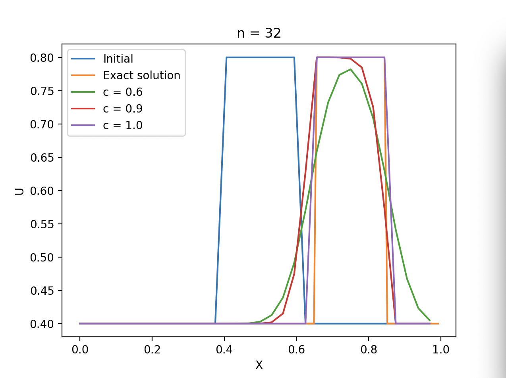
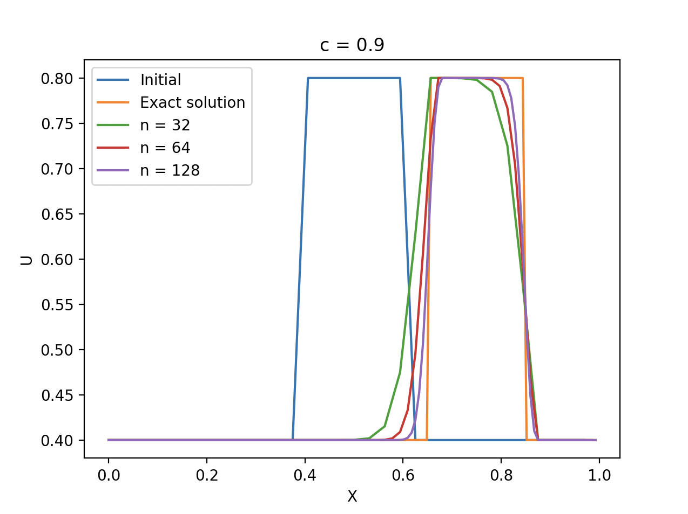
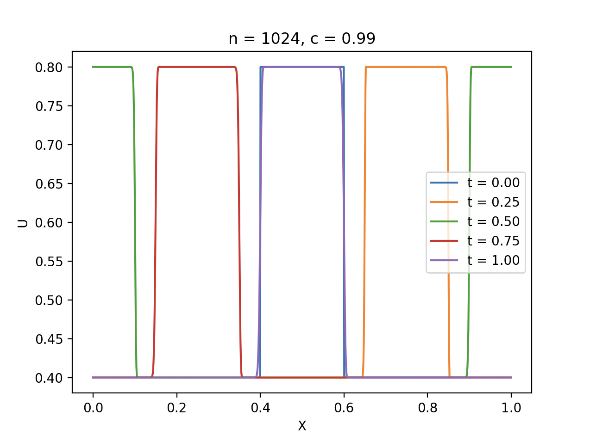

# PDE Solvers

## Solvers

We have:
* Courant-Isaacson-Rees solver

## Plan

* Setup
* * Buld system - Done
* * Basic infra - Done
* * I/O - Done
* * Plotting - Done
* Main part
* * Utility functions - Done
* * Algorithm impl - Done
* * Testing and CI
* Paper
* Method extention

